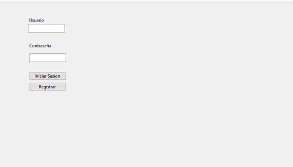
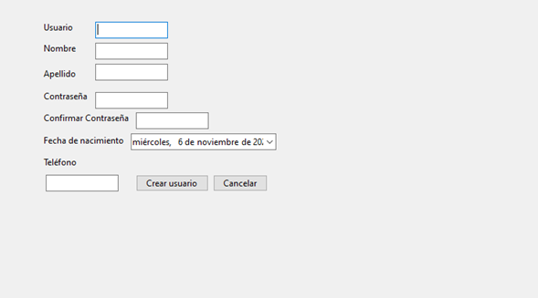
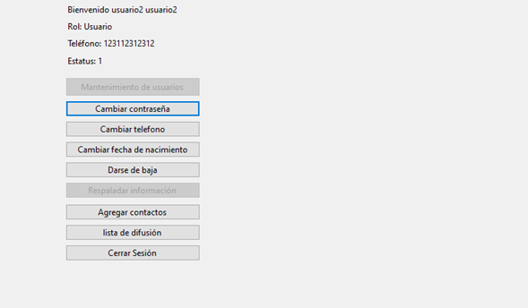
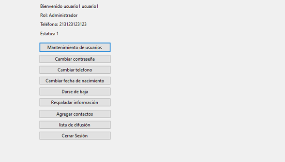
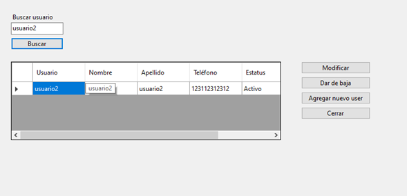
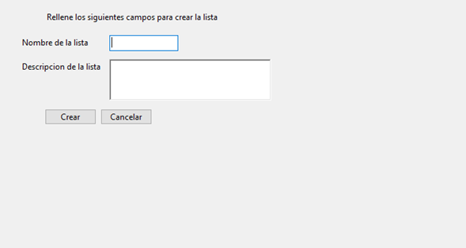
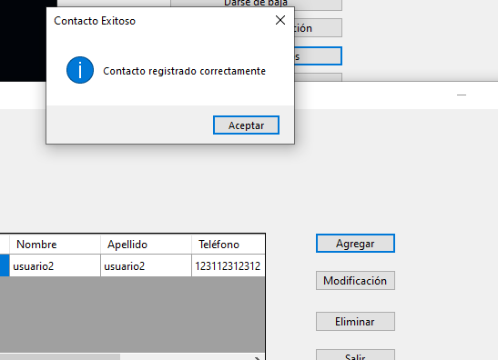

# Message System

Este proyecto es un sistema de administración de listas y contactos que permite crear, modificar y gestionar listas de difusión de usuarios en un entorno de Windows Forms. Está diseñado para almacenar información en archivos locales y permite la reactivación de usuarios en listas de difusión, así como el mantenimiento de usuarios en la plataforma.

## Índice

1. [Análisis](#análisis)
   - [Entradas](#entradas)
   - [Restricciones](#restricciones)
   - [Salidas](#salidas)
2. [Procesos y Estructuras](#procesos-y-estructuras)
   - [Clases](#clases)
   - [Métodos Importantes](#métodos-importantes)
3. [Manual de Usuario](#manual-de-usuario)
   - [Funciones de la Fase 1](#funciones-de-la-fase-1)
   - [Funciones de Listas y Contactos](#funciones-de-listas-y-contactos)

---

## Análisis

### Entradas
El sistema permite al usuario ingresar los siguientes datos:
- Nombre de usuario, nombre, apellido, contraseña, fecha de nacimiento, teléfono y rol (administrador o usuario).
- Datos de listas de difusión, como nombre de la lista, usuario asociado, descripción de la lista y fecha de creación.
- Estatus de los usuarios y listas.

### Restricciones
- Los datos deben estar correctamente formateados para evitar errores de almacenamiento y lectura.
- El sistema valida que el archivo exista en la ruta especificada antes de intentar leer o escribir.
- Solo el administrador puede modificar ciertos campos de otros usuarios o dar de baja usuarios.
- Solo se permiten contraseñas con un nivel de seguridad mínimo.

### Salidas
- Visualización de listas de difusión y contactos en pantalla.
- Mensajes de éxito o error según la operación realizada.
- Actualización de archivos `lista_usuario_indice.txt`, `lista_usuario_bloque.txt`, `user.txt`, y otros archivos necesarios en el sistema de archivos.

## Procesos y Estructuras

### Estructuras
- **Archivos**:
  - `user.txt`: Almacena la información de usuarios.
  - `lista_usuario_indice.txt`: Almacena la información del índice de las listas.
  - `lista_usuario_bloque.txt`: Contiene la información detallada de cada lista de difusión.
  - `contactos.txt`: Archivo donde se guardan los contactos asociados a cada usuario.
  - `bitacora_backup.txt`: Registra los respaldos realizados por el administrador.

### Clases
- **modificarListaUsuario**: Formulario para ver y modificar el estatus de listas de difusión.
- **modificarContacto**: Formulario para modificar los contactos de un usuario, permitiendo reactivarlos si están inactivos.
- **User**: Representa un usuario en el sistema, con campos como nombre, apellido, fecha de nacimiento y rol.
- **Lista**: Representa una lista de difusión, con campos como nombre, usuario asociado, descripción, y estatus.
- **Backup**: Clase que maneja el proceso de respaldo de datos, con registros en `bitacora_backup.txt`.

### Métodos Importantes
- **btnIngresarLista_Click**: Agrega una nueva lista de difusión al sistema.
- **btnEliminar_Click**: Desactiva el estatus de un usuario en una lista de difusión.
- **btnReactivar1_Click**: Reactiva el estatus de un usuario en el índice de listas de difusión.
- **btnReactivar2_Click**: Reactiva el estatus de un usuario en el bloque de datos de listas de difusión.
- **btnRehabilitar_Click**: Reactiva un contacto en el archivo `contactos.txt`.
- **Acceso al Sistema**: Verifica las credenciales de usuario y permite acceso solo si el usuario existe y está activo.

Cada uno de estos métodos es responsable de interactuar con los archivos correspondientes, asegurando que la información esté sincronizada y actualizada correctamente.

---

## Manual de Usuario

### Funciones de la Fase 1

1. **Acceso al Sistema**
   - Al ingresar al sistema, el usuario deberá introducir su usuario y contraseña. El sistema validará las credenciales contra el archivo `user.txt` en `C:/MEIA`.

      
   - Si el usuario no existe, el sistema permitirá crear un nuevo usuario. El primer usuario registrado será administrador, y los siguientes serán usuarios normales, a menos que un administrador les cambie el rol.
     
     

2. **Mantenimiento de Usuarios**
   - **Para Usuarios Normales**:
     - Cambiar su propia contraseña, fecha de nacimiento, o teléfono.
     - Darse de baja (el estatus del usuario cambia de 1 a 0 en el archivo).
       
     
   - **Para Administradores**:
     - Cambiar sus propios datos como el usuario normal.
     - Ingresar nuevos usuarios al sistema.
     - Buscar usuarios y modificar su información.
     - Dar de baja a otros usuarios (el estatus cambia de 1 a 0). Nota: un administrador no puede darse de baja a sí mismo.
       
      
     
3. **Búsqueda de Usuarios**
   - Los usuarios pueden ingresar un nombre de usuario y verificar si existe en el sistema. La búsqueda solo indicará si el usuario existe o no.
     
      

4. **Respaldo de Información**
   - Esta opción está habilitada solo para el administrador. Permite al usuario realizar una copia de todos los datos almacenados en `C:/MEIA` en una ubicación de respaldo elegida. El respaldo se almacena en un directorio `MEIA_Backup`.
   - Cada respaldo se registra en `bitacora_backup.txt` con la ruta del respaldo, el usuario y la fecha de operación.

---

### Funciones de Listas y Contactos

#### 1. Agregar una Nueva Lista de Difusión
   - Dirígete a la sección para agregar listas de difusión.
   - Completa los campos solicitados: Nombre de lista, usuario, usuario asociado, descripción, y fecha de creación.
   - Haz clic en el botón **Aceptar** para guardar la lista en el sistema.
   - Los datos se almacenarán en `lista_usuario_indice.txt` y `lista_usuario_bloque.txt`
     
      

#### 2. Modificar el Estatus de un Usuario en una Lista de Difusión
   - Ve a la sección **Modificar Lista de Usuario**.
   - Selecciona el usuario y la lista deseada.
   - Solo podrás modificar el campo de **Estatus**.
   - Haz clic en **Reactivar** para cambiar el estatus del usuario a "activo" en la lista seleccionada.

#### 3. Reactivar un Contacto
   - Ve a la sección **Modificar Contacto**.
   - Selecciona el contacto deseado.
   - Si el contacto está inactivo, podrás reactivarlo haciendo clic en el botón **Rehabilitar**.
   - El contacto se activará nuevamente y aparecerá en tus contactos activos.
     
      

#### 4. Guardado Automático de Cambios
   - Cada vez que realices una modificación, la aplicación actualizará automáticamente los archivos de almacenamiento para reflejar los cambios.

#### 5. Errores y Mensajes
   - Si intentas realizar una acción no permitida o el sistema encuentra un problema, se mostrará un mensaje de error.
   - Los mensajes de éxito aparecerán al completar correctamente una operación.

---

## Consideraciones Finales
Este sistema se basa en archivos de texto para el almacenamiento de datos, por lo que es fundamental que la estructura de los archivos se mantenga para evitar problemas de lectura y escritura. Es importante que los archivos estén ubicados en `C:/MEIA` y que sigan el formato especificado para asegurar un funcionamiento correcto.

Esperamos que este sistema sea útil y práctico para la administración de listas de difusión, contactos y usuarios en tu entorno local.
